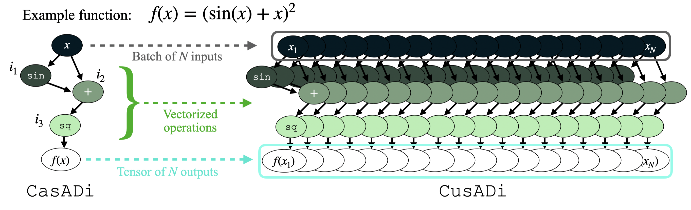
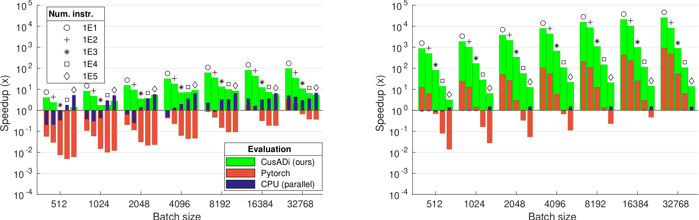

<a id="readme-top"></a>

<br />
<div align="center">

  <h1 align="center">CusADi</h1>

  <h3 align="center">
    Parallelizing symbolic expressions from CasADi on the GPU
    <br />
  </h3>
</div>

<p align="center">
  <video src="https://github.com/user-attachments/assets/289946ea-c5c7-4929-a82e-8277af8a5b82" width=800 alt="animated" />
</p>
<p align="center">
    Evaluating MPC in parallel for thousands of instances of the MIT Humanoid.
    CusADi efficiently parallelizes functions for applications such as reinforcement learning, parallel simulation, and sensitivity analysis.
</p>


If you use this work, please use the following citation:

```
@article{tmp,
    doi       = {},
}
```
Details of our work can be found in the paper: 


<!-- TABLE OF CONTENTS -->
<details open>
  <summary>Table of Contents</summary>
  <ol>
    <li>
      <a href="#about">About</a>
    </li>
    <li>
      <a href="#getting-started">Getting Started</a>
      <ul>
        <li><a href="#dependencies">Dependencies</a></li>
        <li><a href="#installation">Installation</a></li>
      </ul>
    </li>
    <li><a href="#usage">Usage</a></li>
    <li><a href="#extensions">Extensions</a></li>
    <li><a href="#license">License</a></li>
    <li><a href="#contact">Contact</a></li>
  </ol>
</details>


<!-- ABOUT THE PROJECT -->
## About The Project

`cusadi` is a framework for parallelizing arbitrary symbolic functions on the GPU.
It extends the graph expression structure of `casadi` by generating and compiling `CUDA` kernels for efficient evaluation of thousands of function instances. 
`casadi` is particularly well-suited for this because of it is able to exploit sparsity when building its expression graphs, ensuring efficient computation.

<p align="center">
   <br>
    The CasADi expression graph is evaluated by iterating through instructions and performing each operation on scalar values. CusADi can exploit this same structure and evaluate the function in parallel with the GPU by vectorizing each operation to act on tensors of data instead of scalars.
</p>


We demonstrate using `cusadi` for several robotics applications, including parallelizing MPC, augmenting RL with parallelized dynamics algorithms, creating parallel simulations, and running parameters sweeps. 
Benchmarks show that `cusadi` offers significant speedups, especially for reinforcement learning applications where significant overhead is incurred from CPU-GPU data transfer.

<p align="center">
   <br>
    (Left): Speedups from CusADi relative to serial CPU evaluation of five functions, each increasing in complexity. <br>
    (Right): Speedups from CusADi relative to serial CPU evaluation, including overhead time from CPU-GPU data transfer. 
</p>

<p align="right">(<a href="#readme-top">back to top</a>)</p>


<!-- GETTING STARTED -->
## Getting Started

This is an example of how you may give instructions on setting up your project locally.
To get a local copy up and running follow these simple example steps.

### Dependencies

`cusadi` was built on the following. Other versions may work, but are untested.

* Ubuntu 20.04
* Python 3.8+
* `casadi` 3.6.5: https://web.casadi.org/get/
* `CUDA` Toolkit: https://developer.nvidia.com/cuda-downloads?target_os=Linux&target_arch=x86_64
    - Version 12.3 was used, but 12.X should work
    - Add the installation to the `PATH` variable to be able to compile and find `CUDA` libraries. Make sure to replace `cuda-12.3` with the installed version:
        ```
        export PATH="/usr/local/cuda-12.3/bin:$PATH"
        export LD_LIBRARY_PATH="/usr/local/cuda-12.3/lib64:$LD_LIBRARY_PATH"
        ```
* (Optional, for running benchmarks) Eigen

### Installation

1. Clone this repository (standalone, or into a larger project)
    ```
    git clone https://github.com/se-hwan/cusadi
    ```
2. (Optional) Setup a virtual environment for required Python dependencies
    ```
    python -m venv .cusadi_venv         # Python virtual environment
    source .cusadi_venv/bin/activate
    ```
3. Install `cusadi`. From the root of the cloned repository, run:
    ```
    pip install -e .
    ```
4. Compile the test function for parallelization.
    ```
    python run_codegen.py --fn=test
    ```
5. Evaluate the parallelized function for accuracy. The error should be ~1e-10 or smaller. If successful, then `cusadi` is ready for use!
    ```
    python run_cusadi_function_test.py --fn=test
    ```

<p align="right">(<a href="#readme-top">back to top</a>)</p>


<!-- USAGE EXAMPLES -->
## Usage

1. Define some symbolic `casadi` function for parallelization. This function could be the dynamics of a system, a value iteration update, a controller, etc., but do not need to be limited to optimal control applications. There are many examples and tutorials available online:
    - https://web.casadi.org/docs/
    - https://folk.ntnu.no/vladimim/#/6
    - https://www.syscop.de/files/2022ws/numopt/ex1.pdf
    - In our case, we'll parallelize the dynamics of a pendulum as a trivial example. `casadi` is available in C++, MATLAB, and Python, but we'll do this example in MATLAB
        ```
        % Add casadi to MATLAB path. Do this for wherever the casadi folder is downloaded from https://web.casadi.org/get/
        addpath(genpath('[CASADI_FOLDER_LOCATION]'));
        import casadi.*

        % Symbolic expressions
        x_pend = casadi.SX.sym('x_pend', 2, 1);             % pendulum state
        g = casadi.SX.sym('g', 1, 1);                       % pendulum parameters, gravity and length
        l = casadi.SX.sym('l', 1, 1);
        dt = casadi.SX.sym('dt', 1, 1);                     % simulation timestep

        f_pend = [x_pend(2); -g*sin(x_pend(1))/l];          % pendulum dynamics
        J_pend = jacobian(f_pend, x_pend);                  % Jacobian of pendulum dynamics w.r.t the state
        omega_next = x_pend(2) - (g*sin(x_pend(1))/l)*dt    % Semi-implicit Euler integration of dynamics
        theta_next = x_pend(1) + omega_next*dt
        x_next_pend = [theta_next; omega_next];

        % Export and save as casadi functions
        % [casadi_expr] = casadi.Function('[fn_name]', {[input1, input2, ...]}, {[output1, output2, ...]})
        fn_dynamics = casadi.Function('fn_dynamics', {x_pend, g, l}, {f_pend});
        fn_jacobian = casadi.Function('fn_jacobian', {x_pend, g, l}, {J_pend});
        fn_sim_step = casadi.Function('fn_sim_step', {x_pend, g, l, dt}, {x_next_pend});

        fn_dynamics.save('fn_dynamics.casadi')
        fn_sim_step.save('fn_sim_step.casadi')
        fn_jacobian.save('fn_jacobian.casadi')
        ```
2. Move the saved functions to `src/casadi_functions` of the `cusadi` directory.
2. Compile the functions for parallelization. From the root directory of `cusadi`:
    ```
    python run_codegen.py --fn=fn_dynamics
    python run_codegen.py --fn=fn_sim_step
    python run_codegen.py --fn=fn_jacobian
    ```

3. Evaluate the parallelized functions with `cusadi` in PyTorch
    ```
    import torch
    from cusadi import *
    from casadi import *

    BATCH_SIZE = 10000

    x0 = torch.rand((BATCH_SIZE, 2), device='cuda', dtype=torch.double)                 # Random initial states
    g = 9.81 * torch.ones((BATCH_SIZE, 1), device='cuda', dtype=torch.double)           # Gravity for each env.
    l = torch.rand((BATCH_SIZE, 1), device='cuda', dtype=torch.double)                  # Random lengths for each env.
    dt = torch.linspace(0.001, 0.1, BATCH_SIZE, device='cuda', dtype=torch.double)      # Varying timestep for each env.

    fn_casadi_sim_step = casadi.Function.load(os.path.join(CUSADI_FUNCTION_DIR, "fn_sim_step.casadi"))
    fn_cusadi_sim_step = CusadiFunction(fn_casadi_sim_step, BATCH_SIZE)
    fn_cusadi_sim_step.evaluate(x0, g, l, dt)           # Evaluate fn. with CUDA kernel 
    x_next = fn_cusadi_sim_step.outputs_sparse[0]       # Access results.
    ```
4. With this example, by putting the `evaluate()` call in a for loop, a parallel simulator can be created. You can quickly sweep the effect of the parameters (`l` and `g`) or timestep (`dt`) on the system as well.

<p align="right">(<a href="#readme-top">back to top</a>)</p>


## Extensions

- [x] Release 1.0
- [ ] Support for `JAX`
- [ ] Interface with `cuBLAS`, `cuSPARSE`
- [ ] Explore CPU parallelism opportunities
- [ ] Streamline exporting, saving, and compilation flow
- [ ] IsaacGym/Orbit/IsaacLab examples
- [ ] Public examples for parallelized MPC, other optimal controllers (coming soon!)

<p align="right">(<a href="#readme-top">back to top</a>)</p>


<!-- LICENSE -->
## License

Distributed under the MIT License. See `LICENSE.txt` for more information.

<p align="right">(<a href="#readme-top">back to top</a>)</p>


<!-- CONTACT -->
## Contact

Please feel free to reach out with any questions!

Se Hwan Jeon - sehwan@mit.edu

<p align="right">(<a href="#readme-top">back to top</a>)</p>

